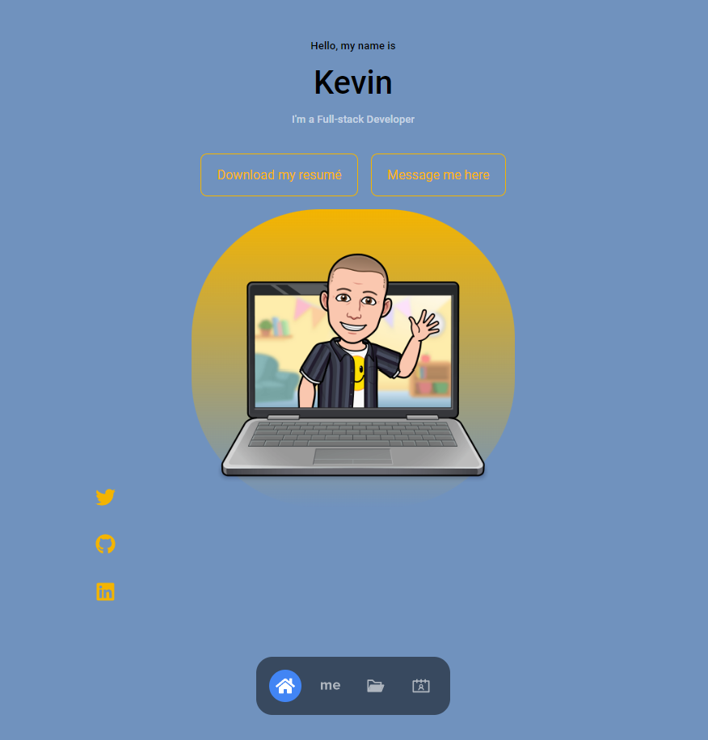

# Personal React Portfolio

## Description
My personal portfolio built with React!

## Table of Contents
* [Installation](#installation)
* [Usage](#usage)
* [Contributors](#contributors)
* [Tests](#tests)
* [Questions](#questions)
* [License](#license) 

## Installation
To run locally (development server) use npm install to install all the dependencies, and run with npm start.

## Usage
This is my personal portfolio to showcase my work. It uses HTML, CSS, Node, React, and emailjs! See screenshot below.

## Contributors
None

## Tests
Tested using the development server built into React.

Contact information (email address & GitHub username) of the developer
## Questions
kevin.o.foreman2@gmail.com || github.com/kevin-foreman

## License

The license used for this project is MIT

Live link to the website!
https://kevin-foreman.github.io/Personal-React-Portfolio/

Screenshot of the application

